# Hi, I'm @nullskymc 👋

AI student and open-source builder. I enjoy turning ideas into working tools—especially around LLMs, agents, and practical developer utilities.

- 🔭 Currently building and iterating on agentic tools and language-model workflows
- 🌱 Exploring LLM application patterns, prompt engineering, evaluations, and tool-use orchestration
- 💡 I like projects that make complex workflows simple and usable

## Stats

---

## Featured Projects

- [tavernTranslator](https://github.com/nullskymc/tavernTranslator) — SillyTavern character card translation tool (PNG → extracted text → LLM translation → regenerated card)
  - Live demo: https://translator.nullskymc.site/
  - Tech: Vue.js frontend, FastAPI backend, WebSockets for real-time progress, LLM APIs

- [SeAgent](https://github.com/nullskymc/SeAgent) — Exploration of agent patterns and search-enabled automation

## Tech I use

- Languages & frameworks: Python, JavaScript/TypeScript, Vue.js
- Backend & APIs: FastAPI, WebSockets, REST, LLM APIs
- AI/LLM: Prompting, tool use, evaluations, translation flows
- Dev practices: Clean interfaces, testable components, iterative delivery

## How I work

- Start from the user flow, then design the minimal system to make it reliable
- Prefer clear contracts between frontend ↔ backend ↔ LLMs
- Ship small, iterate fast, measure impact

## Get involved

- Issues and pull requests are welcome across all projects
- If you try Tavern Translator and have feedback, please open an issue!
- I’m open to collaborating on practical LLM tools and agentic workflows

If you find my work useful, consider starring the repos—it helps others discover them. Thanks for visiting!
